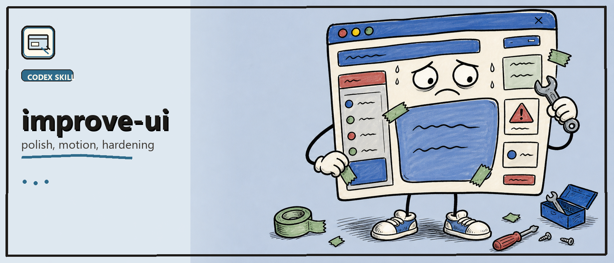

# Improve UI



> Relentless Codex skill pack for improving existing UI, forensic design review, accessibility, motion, typography, and evidence-backed interface hardening.

[](./LICENSE)
[](#status)

Improve UI is the surgeon for existing interfaces. Use it when there is already code, a screenshot, a prototype, a route, a component, or a running app. It preserves the real product path, attacks visible/systemic weakness, patches implementation when editable, and proves the fix.

It is self-contained. When `ruthless-designer` is also installed, the two skills can work together: use `ruthless-designer` for blank-canvas direction and Improve UI for targeted hardening of the implemented result.

## Quick Install

Install with the Skills CLI:

```powershell
npx skills add gvastethecreator/improve-ui-skill --skill improve-ui
```

Or download this repo and ask Codex to install `improve-ui` in your workspace.

## Behavior Contract

- Improve UI starts from evidence of an existing UI and treats advice-only output as failure when source is editable.
- It uses progressive references for typography, surfaces, motion, accessibility, performance, hardening, anti-slop, distinction, and proof.
- It keeps runtime or screenshot proof attached to frontend changes when available.
- P1 and repeated/systemic P2 findings stay red until fixed, blocked, or explicitly deferred.

## Useful Commands

Run the existing-interface detector:

```powershell
node .\SKILLS\improve-ui\scripts\detect-ui-antipatterns.mjs .\SKILLS\improve-ui\fixtures\deep-review-bad.tsx
```

Run the broader existing-interface review harness:

```powershell
node .\SKILLS\improve-ui\scripts\run-interface-review.mjs --path <frontend-path> --out .scratch\improve-ui\<slug> --fail-on=P2
```

Run a strict evidence-backed pass when you have a local URL:

```powershell
node .\SKILLS\improve-ui\scripts\run-interface-review.mjs --path <frontend-path> --url <local-url> --out .scratch\improve-ui\<slug> --require-runtime --require-change-proof --change-proof "before/after screenshots cover the changed main path and one edge state" --fail-verdict=good
```

Run the package smoke check:

```powershell
node .\SKILLS\improve-ui\scripts\run-interface-review.mjs --path .\SKILLS\improve-ui\fixtures\deep-review-bad.tsx --out .scratch\improve-ui-readme-smoke --expect-finding=ease-in-ui-motion --expect-finding=scale-zero-entry --expect-finding=interactive-div --expect-finding=fake-product-preview --expect-finding=heavy-blur-effect --expect-finding=missing-reduced-transparency-fallback --expect-finding=gesture-missing-pointer-capture --expect-verdict=poor --fail-verdict=poor
```

## What's Inside

- [`SKILL.md`](./SKILLS/improve-ui/SKILL.md): existing-interface improvement, audit, roast, hardening, motion, accessibility, and proof workflow.
- [`interface-surgery.md`](./SKILLS/improve-ui/interface-surgery.md): existing-interface diagnosis, cut order, preservation rules, and proof.
- [`surgical-patterns.md`](./SKILLS/improve-ui/surgical-patterns.md): recurring UI failure patterns and systemic repairs.
- [`templates/`](./SKILLS/improve-ui/templates): surgical read, surgery log, evidence ledger, and final checklist.
- [`examples/`](./SKILLS/improve-ui/examples): compact golden examples for dashboard, component, and landing-page repair.
- [`scripts/`](./SKILLS/improve-ui/scripts): static detector and review harness.
- [`*.md`](./SKILLS/improve-ui): focused references for typography, surfaces, animation, performance, hardening, audits, visual distinction, proof, and real-data resilience.

## Health Checks

From this repo:

```powershell
git diff --check
node .\scripts\validate-skill.mjs .\SKILLS\improve-ui
node --check .\SKILLS\improve-ui\scripts\run-interface-review.mjs
node .\SKILLS\improve-ui\scripts\run-interface-review.mjs --path .\SKILLS\improve-ui\fixtures\deep-review-bad.tsx --out .scratch\improve-ui-readme-smoke --expect-finding=ease-in-ui-motion --expect-finding=scale-zero-entry --expect-finding=interactive-div --expect-finding=fake-product-preview --expect-finding=heavy-blur-effect --expect-finding=missing-reduced-transparency-fallback --expect-finding=gesture-missing-pointer-capture --expect-verdict=poor --fail-verdict=poor
```

From the canonical skills workspace when this repo is linked into an `agents-matrix` checkout:

```powershell
ruby scripts\validate-skills
.\scripts\sync-global-skills.ps1 -DryRun
```

## Status

Preview skill pack.

- Static detector and fixture are included.
- Browser/runtime proof depends on the target project being runnable.
- Motion and visual recommendations must be verified on the real UI before being called done, or reported as blocked.
- For blank-canvas design, install the separate `ruthless-designer` skill.

## License

MIT.
